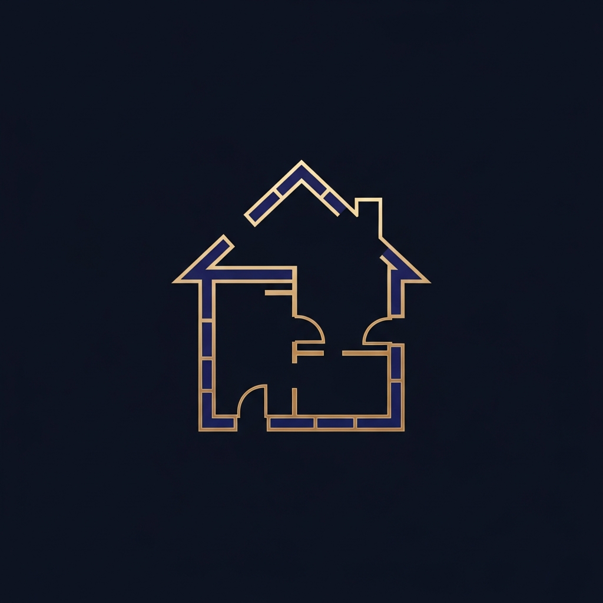

<div align="center">



# PlanAura

**Design floor plans. Analyze energy. Estimate costs.**

*A professional-grade spatial design tool for iOS & Android — built offline-first, powered by Vastu intelligence.*

[](https://expo.dev)
[](https://reactnative.dev)
[](https://typescriptlang.org)
[](LICENSE)

</div>

---

## What is PlanAura?

PlanAura is a mobile-first floor plan designer that combines precision spatial design with Vastu Shastra energy analysis and real-time construction cost estimation — all running fully offline on your device.

It's built for homeowners, architects, interior designers, and anyone who wants to visualize and optimize a living space before breaking ground. No account required. No internet needed. Just open and design.

> Globally positioned as a **spatial energy optimization tool** — not just a Vastu app.

---

## Core Features

### Canvas Designer
A Figma-grade interactive canvas built from scratch on React Native SVG.

- Drag to draw rooms with live dimension preview
- Select, move, resize with 8-handle bounding box
- Pinch-to-zoom with stable midpoint, pan with inertia
- Alignment snap guides across all room edges and centers
- Undo / redo with full history (up to 50 steps)
- Room type icons rendered inside each room
- Live W×H badge while dragging or resizing
- Minimap with viewport indicator
- Compass widget showing selected room's cardinal direction

### Vastu Energy Analysis
Real-time Vastu Shastra scoring based on room placement and cardinal directions.

- Animated arc gauge (0–100 score)
- Per-room issue detection with severity levels (high / medium / low)
- Positive placement recognition
- Actionable suggestions with recommended directions
- Score color coding: green / amber / red

### Cost Estimation
Live construction cost breakdown that updates as you design.

- 3 tiers: Economy · Standard · Premium
- Per-sqft rate calculation (₹1,500 / ₹2,500 / ₹4,500)
- Animated cost breakdown: Structure · Interiors · Electrical · Plumbing
- Animated number counter on tier switch
- Flash animation on cost change

### Plans Management
Full local persistence with a polished saved plans library.

- Save, load, rename, delete plans
- Per-card Vastu score + cost estimate chips
- Room type color pills
- Skeleton shimmer loading state
- Staggered card entrance animations

### Marketplace (v1 Preview)
Browse architects, contractors, and building materials.

- Top-rated architects with specialization, experience, hourly rate
- Contractors with project count and average cost
- Materials with stock status and per-unit pricing
- Full contact/quote flow coming in v2

---

## Design System

PlanAura uses a custom design system built around a **Red + White + Glassmorphism** aesthetic — inspired by Apple's spatial UI and Nike's bold minimalism.

| Token | Value |
|---|---|
| Primary | `#E02020` Crimson Red |
| Background | `#FAFAFA` / `#0A0A0A` |
| Card | `#FFFFFF` / `#141414` |
| Glass | `rgba(255,255,255,0.72)` |
| Border Radius | 16px standard |
| Button Height | 48px touch target |
| Grid | 8px base unit |

**Typography** — Inter (400 · 500 · 600 · 700) via `@expo-google-fonts/inter`

**Dark mode** — full token-level dark palette, automatic system detection

**Glassmorphism** — BlurView panels on iOS, solid fallback on Android

---

## Tech Stack

| Layer | Technology |
|---|---|
| Framework | React Native 0.81 + Expo 54 |
| Navigation | Expo Router 6 (file-based) |
| Language | TypeScript 5.9 (strict) |
| State | Zustand 5 |
| Persistence | AsyncStorage (offline-first) |
| Canvas | react-native-svg |
| Animations | React Native Animated API (native driver) |
| Gestures | PanResponder (zero-lag, ref-based) |
| Export | react-native-view-shot + Share API |
| Styling | StyleSheet (no CSS-in-JS overhead) |
| Monorepo | pnpm workspaces |
| Build | EAS Build (Expo Application Services) |

---

## Architecture

```
planaura/
├── app/                        # Expo Router screens
│   ├── onboarding.tsx          # 3-slide onboarding (shown once)
│   ├── _layout.tsx             # Root layout + ToastProvider
│   └── (tabs)/
│       ├── index.tsx           # Home screen
│       ├── designer.tsx        # Canvas designer
│       ├── plans.tsx           # Saved plans
│       └── marketplace.tsx     # Explore tab
│
├── components/
│   ├── FloorPlanCanvas.tsx     # Core canvas (697 lines, gesture engine)
│   ├── CompassWidget.tsx       # SVG compass with direction tracking
│   ├── VastuPanel.tsx          # Arc gauge + analysis panel
│   ├── CostPanel.tsx           # Animated cost breakdown
│   ├── RoomPropertiesPanel.tsx # Room editor (type, dims, position)
│   ├── ExportButton.tsx        # PNG capture + native share
│   ├── Toast.tsx               # Global toast notification system
│   └── ScalePress.tsx          # Animated press component
│
├── lib/
│   ├── store.ts                # Zustand store (plans, rooms, history)
│   ├── vastu-engine.ts         # Vastu scoring algorithm
│   ├── cost-calculator.ts      # 3-tier cost estimation
│   └── marketplace.ts          # Mock marketplace data
│
├── constants/
│   └── colors.ts               # Full light + dark design tokens
│
└── hooks/
    └── useColors.ts            # Theme-aware color hook
```

---

## Canvas Engine — Technical Notes

The canvas is built entirely on `PanResponder` + `react-native-svg` with a ref-based architecture that avoids React re-renders during gestures.

**Key design decisions:**

- All gesture state lives in `useRef` — zero setState calls during drag/resize/pan
- Only `activeDrag` triggers a re-render (the moving room preview)
- Pinch-to-zoom uses stable midpoint math to prevent canvas jumping
- Pan inertia uses RAF-based exponential decay (`velocity × 0.88` per frame)
- Alignment guides computed on every move frame against all room edges
- Room pop-in uses spring animation (tension 220, friction 8) for satisfying snap
- Selection scale micro-animation (0.97 → 1) on every new room tap

---

## Vastu Engine

The scoring algorithm maps each room's cardinal direction (computed from canvas position relative to center) against Vastu Shastra preferred and avoided directions per room type.

```
Score starts at 100
  − 15 per high-severity issue
  − 10 per medium-severity issue
  − 5  per low-severity issue
  + 5  per positive placement
  Clamped to [0, 100]
```

Directions are recalculated after every room add, move, or resize using `Math.atan2` on the room's center point relative to the canvas origin.

---

## Getting Started

### Prerequisites

- Node.js 18+
- pnpm (`npm install -g pnpm`)
- Expo Go app on your phone, or iOS Simulator / Android Emulator

### Run locally

```bash
# Clone
git clone https://github.com/Anadi99/aura-planner.git
cd aura-planner/artifacts/planaura

# Install
pnpm install

# Start
pnpm run dev
```

Scan the QR code with Expo Go (Android) or Camera app (iOS).

### Build for distribution

```bash
# Install EAS CLI
npm install -g eas-cli
eas login

# Preview build (internal testing)
eas build --profile preview --platform android
eas build --profile preview --platform ios

# Production build (store submission)
eas build --profile production --platform all
```

---

## Roadmap

### v1 — Current (MVP)
- [x] Full canvas designer with gestures
- [x] Vastu energy analysis
- [x] 3-tier cost estimation
- [x] Offline-first with local persistence
- [x] Export floor plan as PNG
- [x] Onboarding flow
- [x] Dark mode
- [x] EAS build config

### v2 — Planned
- [ ] User accounts + cloud sync
- [ ] Marketplace — live contact, quotes, purchases
- [ ] 3D floor plan view
- [ ] AI room suggestions based on Vastu score
- [ ] PDF export with full plan report
- [ ] Multi-floor support
- [ ] Collaboration (share plan with architect)
- [ ] Push notifications for marketplace responses

---

## Target Market

| Segment | Use Case |
|---|---|
| India | Vastu-compliant home design before construction |
| Global | Spatial layout optimization for any living space |
| Architects | Quick client-facing floor plan sketching |
| Interior Designers | Room placement and energy flow visualization |
| Homeowners | DIY floor planning with cost awareness |

---

## License

MIT — see [LICENSE](LICENSE)

---

<div align="center">

Built with precision. Designed with intent.

**PlanAura** — *Where space meets energy.*

</div>
